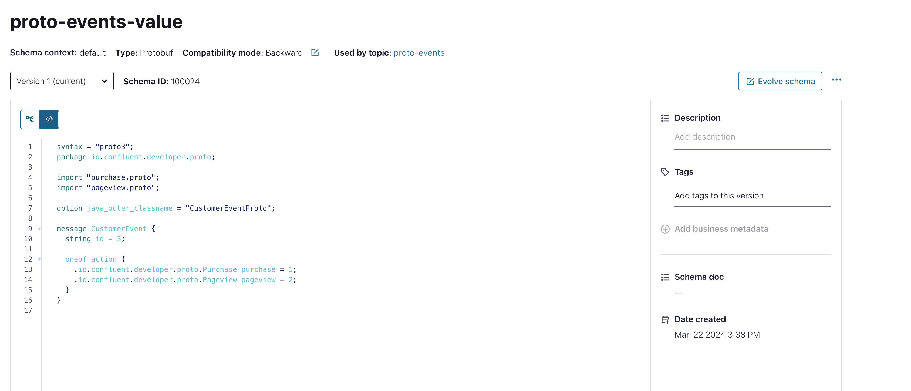
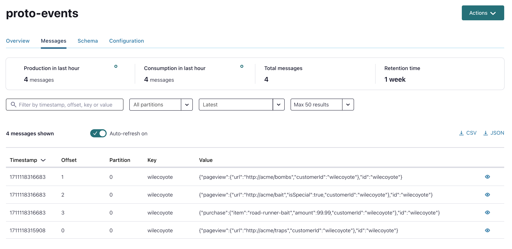

# Questions

Here you will questions around schema management. This list is not complete.

# What is best method for protobuf?

Note that best practice for Protobuf is according to the documentation to use BACKWARD_TRANSITIVE, as adding new message types is not forward compatible. See [Docu](https://docs.confluent.io/platform/current/schema-registry/fundamentals/schema-evolution.html#:~:text=Note%20that%20best%20practice%20for,types%20is%20not%20forward%20compatible.)

# Customer want to use protobuf as event schema format. They want to use mode FULL for schema evolution. Are there any problem for old consumer to not run into serialisation issues?

Using Protobuf with the FULL schema evolution mode in a Confluent setup shouldn't cause serialization issues for old consumers as long as the changes made to the schema are backward-compatible.

When you use the FULL schema evolution mode in Confluent Schema Registry, it allows you to make backward-compatible changes to your schema, which means that existing consumers can still deserialize messages produced with the updated schema without any issues. Backward-compatible changes include:

1. Adding new fields with default values.
2. Changing the type of a field to a subtype (e.g., changing an int to a long).
3. Adding new enumeration constants to an existing enum.
4. Adding new optional fields.

However, you need to avoid making backward-incompatible changes that could lead to serialization issues for old consumers. Backward-incompatible changes include:

1. Removing fields.
2. Changing the type of a field to a supertype (e.g., changing a long to an int).
3. Renaming fields.
4. Changing the order of fields.

As long as you stick to making backward-compatible changes to your Protobuf schema and configure your Confluent Schema Registry to use the FULL schema evolution mode, old consumers should be able to deserialize messages produced with the updated schema without any problems. It's essential to carefully review your schema changes to ensure backward compatibility and conduct thorough testing to validate compatibility with existing consumers before deploying changes to a production environment.

# When to set the property use.latest.version for consumer and producer?

The property `use.latest.version` (default is false) is typically used when working with schema evolution in Apache Kafka and the Confluent Schema Registry. It allows consumers and producers to use the latest registered version of the schema for message serialization and deserialization. See [docu](https://docs.confluent.io/platform/current/schema-registry/connect.html#configuration-options). Generally speaking you can also pin the Schema ID by `use.schema.id` see [docu](https://docs.confluent.io/platform/current/schema-registry/fundamentals/serdes-develop/index.html#specifying-schema-id-and-compatibility-checks)

Here's when you might want to use it:

1. Consumer Side:
When you have consumers that need to dynamically adapt to schema changes without needing manual intervention.
When you want your consumers to automatically use the latest version of the schema registered in the Schema Registry.
2. Producer Side:
When you have producers that need to produce messages using the latest schema version available in the Schema Registry.
When you want to ensure that all produced messages are serialized using the most up-to-date schema definition.

Setting `use.latest.version` to true on both the producer and consumer side ensures that they always use the latest schema version available in the registry. This can be useful in dynamic environments where schemas might evolve frequently, and you want your applications to seamlessly handle those changes without manual intervention.

However, **keep in mind that blindly using the latest schema version might lead to compatibility issues** if the changes are not backward-compatible. It's essential to understand your schema evolution strategy and ensure that new versions are backward-compatible to avoid breaking existing consumers.

# If I set on producer `use.latest.version` to false and try to get the schema from object what do I need to care of?

If you set `use.latest.version` to false on the producer side and you want to manually specify the schema for message serialization, you'll need to handle schema versioning and schema management yourself. Here are a few things to consider:

0. Retrieve Schema by Version: You need to retrieve the specific version of the schema you want to use for serialization. This involves querying the Schema Registry to fetch the schema by its version number.
1. Specify Schema Version: You'll need to specify the exact schema version you want to use for serialization. This means you need to keep track of schema versions and explicitly specify the version number in your producer code.
2. Schema Compatibility: Ensure that the schema version you specify is compatible with the messages you are producing. If the schema version is not compatible, it may lead to serialization errors or incorrect data being sent to Kafka.
3. Schema Registration: You'll need to ensure that the schema is registered in the Schema Registry before you attempt to use it for serialization. If the schema is not registered, you won't be able to retrieve it by version number.
4. Handling Schema Evolution: If your schema evolves over time, you'll need to manage schema evolution manually. This includes registering new schema versions in the Schema Registry and updating your producer code to use the latest compatible schema version.
5. Error Handling: Make sure to handle errors gracefully, especially when retrieving schemas or serializing messages. If there are any issues with schema retrieval or serialization, your producer should handle them appropriately to avoid data loss or inconsistencies.

Overall, manually managing schema versions and serialization adds complexity to your producer code. It's generally more convenient to use use.latest.version set to true if your use case allows it, as it automates schema management and ensures compatibility with the latest schema version. However, if you have specific requirements or constraints that necessitate manual schema versioning, you'll need to carefully handle these aspects in your producer code.

Here's an example of how you might configure the producer to use a specific schema version in Python using the confluent_kafka library:

```python
from confluent_kafka import Producer, KafkaError

# Kafka broker configuration
bootstrap_servers = '<YOUR_BOOTSTRAP_SERVERS>'
topic = 'user-topic'

# Schema version to use for serialization
schema_version = 1  # Example: specify the schema version you want to use

# Create a Kafka producer
producer = Producer({
    'bootstrap.servers': bootstrap_servers,
    'schema.registry.url': '<SCHEMA_REGISTRY_URL>',
    'use.latest.version': False,  # Ensure this is set to False
    'use.schema.id': schema_version  # Specify the schema version to use
})

# Produce messages using the specified schema version
# Your producer logic goes here...
``` 

You can derive a schema from message (maven-plugin). See [derive-schema](https://docs.confluent.io/cloud/current/sr/develop/maven-plugin.html#schema-registry-derive-schema) command.

# is `use.latest.version` also relevant for the consumer?

In Python DeSerializer we do not know the parameter. See [Code](https://github.com/confluentinc/confluent-kafka-python/blob/master/src/confluent_kafka/schema_registry/protobuf.py#L446), I tested it in Python Client see `protobuf_consumer.py` the result:
* No error to set it
* If I set to false, and add a field to schema, old data are consumed without error
* If I set to true, same result, no error, no new field.

In Java, the code uses `use.last.version` in Deserialization. see [code](https://github.com/confluentinc/schema-registry/blob/master/protobuf-serializer/src/main/java/io/confluent/kafka/serializers/protobuf/AbstractKafkaProtobufDeserializer.java)


In General, `use.latest.version` is relevant for consumers as well as producers when working with a schema registry. This setting determines whether the consumer should use the latest registered schema version for deserialization.

When `use.latest.version` is set to true on the consumer side, it means that the consumer will dynamically adapt to schema changes and use the latest registered schema version available in the schema registry. This ensures that the consumer can process messages serialized with the latest schema version without manual intervention.

On the other hand, when `use.latest.version` is set to false, the consumer will not automatically use the latest schema version. Instead, it will use the schema version specified in the message or configuration. This allows for more explicit control over the schema version used for deserialization, which can be useful in certain scenarios, such as testing or backward compatibility validation.

In summary, `use.latest.version` is relevant for consumers as it determines whether they should dynamically adapt to schema changes by using the latest schema version registered in the schema registry.


# Protobuf: When forward compatibility method is not achievable for protobuf?

In the context of schema evolution with Protobuf, the **"forward compatibility"** refers to the ability to read new data with an old schema. It means that if a new field is added to a message, an old consumer that's unaware of this new field should still be able to read and process the message without errors, ignoring the new field.

However, there are situations where achieving forward compatibility with Protobuf schemas may not be feasible or practical:

1. **Semantic Changes**: Forward compatibility becomes challenging when there are semantic changes to the message structure. For example, if the meaning of an existing field changes, or if the interpretation of the message content changes, it may not be possible for old consumers to correctly process the new messages even if the schema technically remains backward-compatible.
2. **Non-Optional Fields**: If a new required field is added to a message, old consumers will not be able to read the new messages without breaking compatibility. This is because required fields must be present in all messages, and old consumers won't be aware of the new required field, leading to deserialization errors.
3. **Enum Changes**: Modifying or reordering enum values in a Protobuf schema can break forward compatibility if old consumers rely on specific enum values or their order. Adding new enum values without removing existing ones is generally safe for forward compatibility.
4. **Backward-Incompatible Changes**: Any backward-incompatible change to the schema will obviously break forward compatibility. This includes removing fields, changing field types in incompatible ways, or changing field IDs.
5. **Complex Evolution Scenarios**: In some complex schema evolution scenarios, achieving forward compatibility without breaking changes may not be feasible due to the nature of the changes or the requirements of the application.

In summary, achieving forward compatibility with Protobuf schemas depends on the nature of the changes made to the schema and the requirements of the application. While Protobuf provides mechanisms for handling backward-compatible schema changes, achieving forward compatibility may not always be possible or practical, especially in scenarios involving semantic changes or non-optional field additions.

# Config test with `auto.register.schemas` and `use.latest.version`

1. Test: 
Can produce a current version of a message, or a backwards compatible version of a message. When trying to produce a message with a schema that doesn’t exist, I got an error message that the schema does not exist, even if it is backwards compatible. the setting force our clients to only use schemas that exist that are backwards compatible.

```python
serializer_conf = {
    'auto.register.schemas': False,
    'use.latest.version': False
}
```

2. Test: 
Can successfully produce only a message with the latest schema, backwards compatibility is totally ignored

```python
serializer_conf = {
    'auto.register.schemas': False,
    'use.latest.version': True
}
``` 

3. Test:
`auto.register.schemas = false` and did not set the `use.latest.version` set in a Java application. 
Could be that there is an issues with schema compatibility. 
Set `use.latest.version=false` in your configuration and it worked. Typically `use.latest.version=false` is set by default to false.

4. Test:
You can have a producer use any version of the schema that works for the data, not register new schemas, and normalize the data with the below config:
```bash
use.latest.version=false
auto.register.schemas=false
normalize.schemas=true
```


#  use.latest.version=false and run into an issue looking up the schema related to different ordering of metadata properties in the proto derived from the object

Case is: set “use.latest.version” to false to have producer deriving the good schema from the object. While trying to achieve that, we run into an issue looking up the schema related to different ordering of metadata properties in the proto derived from the object and the one in schema. Should that be solved using normalization?

The [docu](https://docs.confluent.io/platform/current/schema-registry/fundamentals/serdes-develop/index.html#schema-normalization) says:
When using Protobuf with a schema registry and setting `use.latest.version = false`, the producer relies on the schema associated with the object being serialized rather than automatically using the latest registered schema version. 
If you encounter issues with schema lookup due to differences in metadata ordering between the schema and the object derived from the Protobuf definition, **normalization** could indeed be a solution.
Protobuf messages are binary-encoded, and the order of fields in the binary representation should not matter. However, when dealing with schema registries or other systems that inspect Protobuf schemas, metadata such as field IDs may be ordered differently. This can lead to schema lookup issues if the metadata ordering between the schema and the object does not match.
Normalization involves ensuring that the metadata ordering in the schema matches that of the object being serialized. 
This typically involves ensuring that the fields in the Protobuf definition are declared in the same order as they appear in the serialized object.
Here are some steps you can take to address schema lookup issues due to metadata ordering differences:

* **Check Protobuf Definition**: Ensure that the fields in the Protobuf definition are declared in the same order as they appear in the serialized object. This ensures consistency between the schema and the serialized object.
* **Use Tools for Normalization**: There are tools available that can help with normalizing Protobuf definitions to ensure consistent metadata ordering. These tools can automatically reorder fields in the Protobuf definition to match the ordering in serialized objects.
* **Verify Schema Compatibility**: After normalization, verify that the normalized schema is compatible with existing data and other consumers. Ensure that the changes do not introduce backward compatibility issues.
* **Testing and Validation**: Thoroughly test the normalized schema with various data scenarios to ensure that it behaves as expected and does not cause any issues with schema lookup or serialization.
* **Consult Documentation and Community**: Check the documentation of the schema registry and any relevant Protobuf tools for guidance on schema normalization. 

By normalizing the Protobuf schema to ensure consistent metadata ordering, you can resolve schema lookup issues and ensure smooth operation when setting use.latest.version to false in your Kafka producer.

# Use case : Running a replay from topic pattern

Schema Registry can enforce compatibility rules to ensure that schemas evolve in a way that is compatible with the consumers [Read-me](ReadME.md)

When running a replay from a topic, ensuring that your consumers can handle the message format is crucial. This includes:

1. Configuring the Consumer: Make sure your Kafka consumer uses the correct deserializer. For ProtoBuf, this would typically be `io.confluent.kafka.serializers.KafkaProtobufDeserializer`.
2. Compatibility: Before the replay, ensure the schema compatibility is set correctly. If schemas have evolved, you might need to adjust the compatibility mode to ensure your consumers can deserialize the messages.
3. Schema Evolution: Pay attention to how your schemas have evolved. Adding new fields with defaults or removing optional fields are generally safe operations in a backward-compatible manner. However, any significant changes might require more careful planning.

**Monitoring and Managing Schemas**
* Monitoring Schema Registry: Keep an eye on the Schema Registry's logs and metrics to ensure it operates correctly.
* Managing Schemas: Use the Schema Registry API to manage schemas, check compatibility, and register new schema versions as needed.

By properly configuring your Schema Registry and ensuring compatibility, you can smoothly run a replay from a topic, even in scenarios where schemas have evolved. This setup helps maintain data integrity and application reliability in a system leveraging Avro and Kafka.

# Some Hints, when to use which method:

1. **Forward compatibility** is enough when the producer wants to update events without breaking consumers, who still would be able to use the old schema before they update.
2. **Alternatively**, you might want to update consumers first. If that’s your preferred ordering, it’s **backward compatibility** you’ll need to keep. Such an approach is mentioned in the Avro and Schema Registry documentation, check it out for a deeper dive.
3. **Full compatibility** is the most restrictive variant. It is recommended when we want to make sure that even after adjusting consumers to the latest schema, they still will be able to parse older events and have special handling for fields with present or missing values. Choose this approach when you expect historical events to be replayed, allowing correct handling of all older versions by the consumers, for example, in event sourcing.

# Imported Fields in Protobuf

[Developer Note](https://docs.confluent.io/platform/current/schema-registry/fundamentals/serdes-develop/serdes-protobuf.html#developer-notes).

The import public feature highlights some specific considerations when working with Protobuf (Protocol Buffers) versions 2 and 3, especially in the context of the Java ecosystem and by extension, tools that interact with the Confluent Schema Registry. Here's a deeper dive into what this means and its implications:

## The import public Feature in Protobuf

* Protobuf 2 and 3 introduced the concept of import public to allow a schema file to import another schema file and to re-export that imported schema to any schema that imports the former. This mechanism is designed to facilitate the sharing of common schema definitions across multiple Protobuf files without needing to explicitly import them in each file.
* Java Support: However, there's a notable limitation in how this feature is supported in the Java ecosystem. The standard Protobuf tooling for Java does not fully support the resolution of these transitive dependencies created by import public. This means that when you are using Protobuf-generated Java code, the compiler may not automatically resolve and include types from transitive imports unless they are directly imported in the .proto file being compiled.

## Implications for Schema Registry

* Transitive Dependencies: Given Java's limitations with import public, when you upload Protobuf schemas to the Confluent Schema Registry that utilize this feature, the registry's tools might not resolve transitive dependencies as expected. This is because the Schema Registry relies on the underlying Protobuf tooling, which has this inherent limitation in Java.
* Schema Registry and Google/Protobuf Dependencies: It's common to use Google-provided Protobuf dependencies, like the well-known types, in Protobuf schemas. However, because of the aforementioned Java limitation and the way Schema Registry manages dependencies, it's advised not to upload these Google/Protobuf dependencies into the Schema Registry. The reasoning is twofold:
     * Automatic Exclusion Not Supported: The tooling around Schema Registry does not automatically exclude certain dependencies that might cause issues, such as those provided by Google/Protobuf. This means that users must be cautious and manually manage what gets uploaded to avoid potential conflicts or resolution issues.
     * Avoiding Unnecessary Complexity: Uploading external dependencies like those from Google/Protobuf could introduce unnecessary complexity and potential for errors in schema management within the Registry, due to the way dependencies are resolved (or not resolved) by the Protobuf tooling in Java.

## Best Practices

Given these considerations, when working with Protobuf schemas in environments that use the Confluent Schema Registry, it's important to:

* Manually Manage Imports: Be explicit and cautious about what you import and upload to the Schema Registry. Avoid using import public if you expect the Schema Registry to manage transitive dependencies automatically. The Confluent Support knowledge Base announces a how-to: Search for "How to register a schema with references".
* Avoid Uploading External Dependencies: Especially avoid uploading external dependencies that are widely used and might be assumed to be implicitly available, like Google's Protobuf types. Instead, rely on direct imports in your .proto files for clarity and to ensure compatibility.
* Understand Tooling Limitations: Acknowledge the limitations of the Protobuf tooling in Java regarding import public and transitive dependency resolution. Plan your schema design and registry management practices accordingly to avoid unexpected issues.

By navigating these intricacies thoughtfully, you can more effectively manage your Protobuf schemas within the Confluent Schema Registry, ensuring smoother development and deployment processes for your data-driven applications.

for more schema references samples please check:
* [https://developer.confluent.io/tutorials/multiple-event-type-topics/confluent.html](https://developer.confluent.io/tutorials/multiple-event-type-topics/confluent.html)
* [https://github.com/davidaraujo/demo-schema-references](https://github.com/davidaraujo/demo-schema-references) 

# Samples

## Protobuf Schema with References and Java Producer

Confluent do offer a pretty nice example with Schema References. [Handling multiple Event Types in a topic](https://developer.confluent.io/tutorials/multiple-event-type-topics/confluent.html)
What I learned from this example is: Protobif schema with references need be registered differently in this case of gradle.
This sample plays around a schema with references:

```java
syntax = "proto3";

package io.confluent.developer.proto;

import "purchase.proto";
import "pageview.proto"; 

option java_outer_classname = "CustomerEventProto";

message CustomerEvent { 

  oneof action {  
    Purchase purchase = 1;
    Pageview pageview = 2;
  }
  string id = 3;
}
```

The idea is that only one reference could be active for one event.

The registration of avro schema with references is straightforward documented in `build.gradle`;

```java
register {
        subject('pageview', 'src/main/avro/pageview.avsc', 'AVRO')
        subject('purchase', 'src/main/avro/purchase.avsc', 'AVRO')
        subject('avro-events-value', 'src/main/avro/all-events.avsc', 'AVRO')
                .addReference("io.confluent.developer.avro.Pageview", "pageview", 1)
                .addReference("io.confluent.developer.avro.Purchase", "purchase", 1)
    }
```

register
```bash
./gradlew registerSchemasTask
```

We don’t have a corresponding command to register schemas for Protobuf. Instead, you are going to use the auto-registration feature for the Protobuf schemas because Protobuf will recursively register any proto files included in the main schema.

The result is for schema definition:


The topic show only one reference per event record



back to [main](ReadMe.md)
