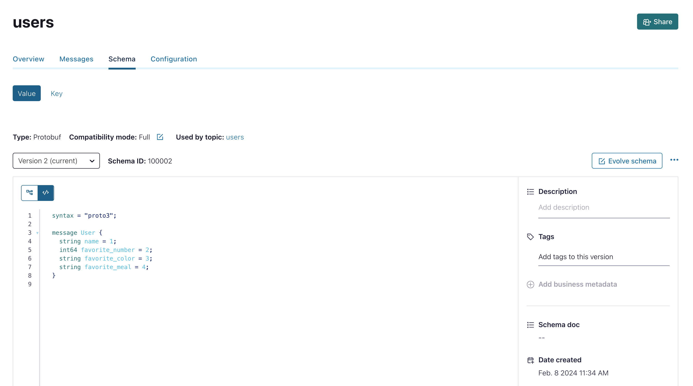
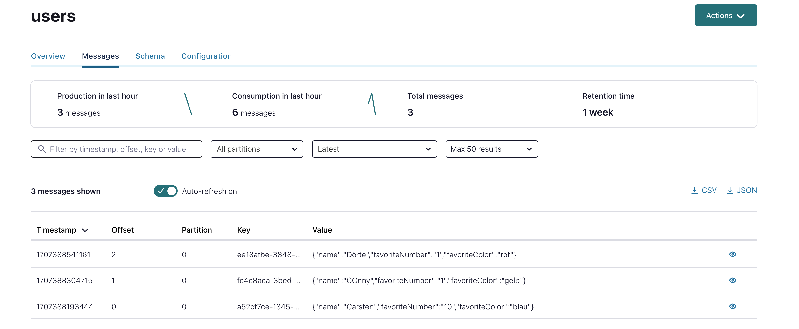

# Protobuf Playground for Schema Evolution Testing

Install the playground on your desktop:

```bash
git clone https://github.com/ora0600/confluent_protobuf_playground.git
cd confluent_protobuf_playground
```


We will create a Cloud Cloud CLuster with Schema Registry and one Topic.
A Python client will produce and another will consume events. You can play around with the Schema, Rules and change versions etc. and see what is happening at client side. The main usecase here is Schema Evolution. Try out and choose the correct Compatibility mode.

# 1. Create Cloud API Keys and Service Account 

Create a Confluent Cloud API Key as Org-Admin:
```bash
confluent login
confluent iam service-account create tf_runner_cmue --description "Terraform Service Account with OrgAdmin Role"
+-------------+--------------------------------+
| ID          | sa-XXXXXX                      |
| Name        | tf_runner_cmue                 |
| Description | Terraform Service Account with |
|             | OrgAdmin Role                  |
+-------------+--------------------------------+
# Align a Role
confluent iam rbac role-binding create --principal User:sa-XXXXXX  --role OrganizationAdmin
+-----------+-------------------+
| ID        | rb-XYBZTe         |
| Principal | User:sa-XXXXXX    |
| Role      | OrganizationAdmin |
+-----------+-------------------+
# Create API Key
confluent api-key create --resource cloud --service-account sa-XXXXXX --description "API Key for tf_runner_cmue OrgAdmin"
It may take a couple of minutes for the API key to be ready.
Save the API key and secret. The secret is not retrievable later.
+------------+------------------------------------------------------------------+
| API Key    | KEYXXXXXXXXXXXXX                                                 |
| API Secret | SECRETYYYYYXXXXXXYXYXXXXXXXXXXXXXXXXXXXXXXXXXXXXXXXXXXXXXXXXXXXX |
+------------+------------------------------------------------------------------+
```
Your terraform OrgAdmin Service Account is ready to use. Store the API key in Environment Variables or create a File
Set Environment Variables:

```bash
cd Part1/01-kafka-ops-team
# SA tf_cmrunner_cmue
export TF_VAR_confluent_cloud_api_key="KEYXXXXXXXXXXXXX"
export TF_VAR_confluent_cloud_api_secret="SECRETYYYYYXXXXXXYXYXXXXXXXXXXXXXXXXXXXXXXXXXXXXXXXXXXXXXXXXXXXX"
``` 

Hint/Attention:
<table><tr><td>To make it easy, our Service Account is OrgAdmin. This is nothing for productivity environments, please follow the least privilege principle.</td></tr></table>


# 2. Pre-Reqs/ Tools

* install terraform on your desktop. [Follow the installation guide](https://developer.hashicorp.com/terraform/tutorials/aws-get-started/install-cli)
* I am running still completely on bash on my Intel Mac. Environment Variables are set in `~/.bash_profile`, if you running other OS or use other Shells like zsh, please setup that script can execute kafka tools without absolution path.
* install Python3 on MacOS: [Downland](https://www.python.org/downloads/macos/) and follow the instructions
* Install all the python modules we need;

# 3. Prepare the Python client:

```bash
pip3 install confluent_kafka
pip3 install kafka-python protobuf
pip3 install jproperties
```

Now, we can create Python Code for Users Schema, I did already do this for you. Anyway:

```bash
protoc -I=. --python_out=. schema/schema-users-value-v2.proto 
cat schema/schema_users_value_v2_pb2.py
```

# Provision the cluster

Create Cluster in Confluent Cloud including topic and schema. Create the client properties files.

```bash
terraform init
terraform plan
terraform apply
```

Cluster in running in Confluent Cloud.

# Start the producer:

```bash 
# with parameter -f properties file -t topic
python3 protobuf_producer.py -f producer.properties -t users
```

Enter same values. 
The Compatibility Mode is Backward on Default. Switch to FULL. You can change this very easily in topic viewer of Confluent Cloud under Schema. 
See what is happening on producer side.
Nothing should change on producer side (no error). Now, add a column into the schema.

```bash
syntax = "proto3";

message User {
  string name = 1;
  int64 favorite_number = 2;
  string favorite_color = 3;
  string favorite_meal = 4;
}
```



Click on validate and save. Now we have version 2. Producer is still running. Enter new records and see what is happening. 
Of course we do have the new column in our code, but could produce?
Yes, this should work, because protobuf field are all optional.



# Start consumer

```bash 
# with parameter -f properties file -t topic
python3 protobuf_consumer.py -f consumer.properties -t users
```

Play around with Schema Evolution and use all the fancy tools in Confluent Cloud like
* Stream Lineage
* Topic Viewer and Schema Editor
* Schema Registry Editor
* etc.


# Destroy the playground

```bash
terraform destroy
```


